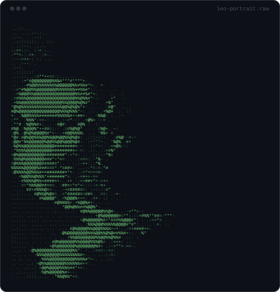

<table border="0" style="border: none; border-collapse: collapse; width: 100%;">
  <tr style="border: none;">
    <td width="50%" align="center" valign="top" style="border: none; padding: 0 4px 0 0;">
      
    </td>
    <td width="50%" align="center" valign="top" style="border: none; padding: 0 0 0 4px;">
      
    </td>
  </tr>
</table>

## Roshan Gautam

**Full Stack Developer**

  

I build scalable web applications and engineer search-driven growth strategies. My work spans full-stack product engineering and technical SEO — from high-throughput FastAPI and Next.js backends to on-page optimization and WordPress builds that convert and rank. I care about shipping software that has measurable impact.

Open to full stack and digital marketing/SEO roles. Let's connect on LinkedIn.

 

## 📊 GitHub Activity

  

<h2 align="center">Contribution Activity</h2>

  <picture>
    <source media="(prefers-color-scheme: dark)" srcset="https://raw.githubusercontent.com/leotechwhiz/leotechwhiz/output/github-snake-dark.svg" />
    <source media="(prefers-color-scheme: light)" srcset="https://raw.githubusercontent.com/leotechwhiz/leotechwhiz/output/github-snake.svg" />
    
  </picture>

