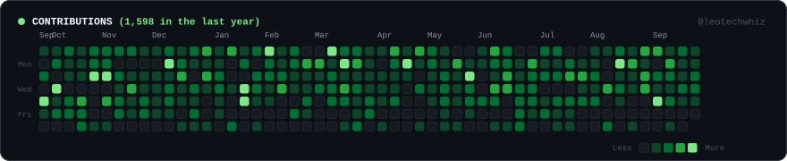

<table border="0" style="border: none; border-collapse: collapse; width: 100%;">
  <tr style="border: none;">
    <td width="50%" align="center" valign="top" style="border: none; padding: 0 4px 0 0;">
      
    </td>
    <td width="50%" align="center" valign="top" style="border: none; padding: 0 0 0 4px;">
      
    </td>
  </tr>
</table>

## Roshan Gautam

**Full Stack Developer**

  
  

I build scalable web applications and engineer search-driven growth strategies. My work bridges technical software engineering with measurable digital distribution, combining robust full-stack architecture with deep technical SEO and performance optimization. From designing high-throughput backends in FastAPI to crafting high-converting Next.js and WordPress experiences, I focus on shipping software that delivers business impact and actually ranks.

Open to full stack and digital marketing/SEO roles. Let's connect on LinkedIn.

 

